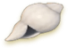
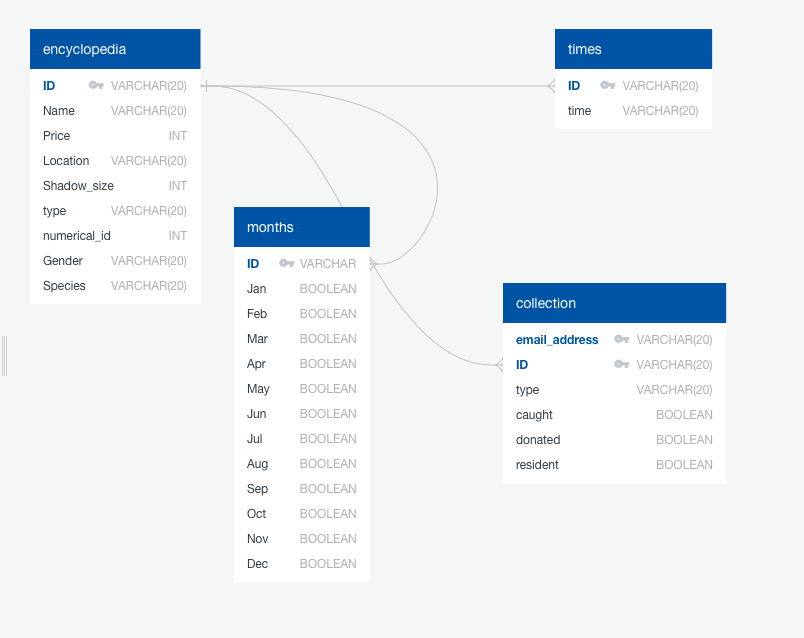
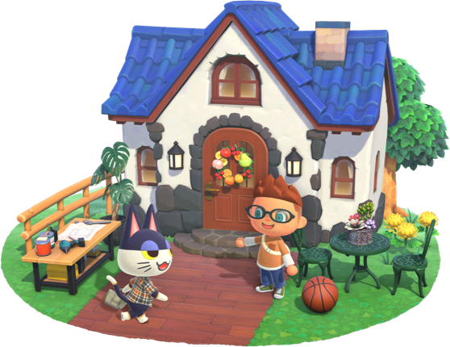

<!DOCTYPE html>
<html>
<body style = "font-family:'Zilla Slab'">

 

 

<h1>
<b>ETL Project - Brian Remite, Jeremy Brent, Kevin Kleyman, Matt Sadowski
</b></h1>

<h2> For this project, we have created a "Critterpedia" of all of the bugs, fish, and villagers within Animal Crossing: New Horizons. Using our tool, you will be able to...</h2>

<ul>
    <li>Collect all of the data for each critter type, including when they are available throughout the year.</li>
    <li>Keep track of which critters you have collected for your museum.</li>
    <li>Which residents you have on your island.</li>
</ul>

<h1> Before You Begin </h1>

<ol>
<li>Create a new database in PostgresSQL titled "ACNH_Critterpedia", and then open up the query tool in the new database.</li>

<li>Copy the code from schema.sql in the root of the repository into the query tool to create the schema within PostgresSQL.</li>

<li>Open and update the <i>/Resources/config.py</i> file with your username and password for PostgresSQL.</li>

<li>Run the Jupyter Notebooks within the Notebooks folder in the numerical order specified to populate the database.
    <ol>
        <li>bugs.ipynb</li>
        <li>fish.ipynb</li>
        <li>villagers.ipynb</li>
        <li>collections.ipynb</li>
    </ol>
    </li>
</ol>

<h2>Our Data Transformation Process</h2>
<ul>
    <li>We scraped the Animal Crossing Wiki web pages for the Fish and Bugs data to pull out the tables.  The tables contain data for Fish and Bug Name, Price, Location, as well as the Time and Months that each is available to catch.  We put both of those tables into a DataFrame and assigned unique IDs for each item.</li>
    <li>We pulled a csv file from Kaggle that contained the data for all of the Villagers such as Name, ID, Gender, Species.</li>
    <li>We combined all of the data for Fish, Bugs and Villagers into a "Critterpedia" which can be used to track all of the players progress in collecting all possible critters.</li>
    <li>Lastly, we created a user table which contains E-Mail addresses for players and their total collections.  This data was all created at random and does not contain any real user data.  This table would be used to track any players real progress in the game.
</ul>

 

<h2><b>Tom Nook</b><h2>

<h1>File Structure</h1>
<ul>
    <li><b>Root</b></li>
        <ul>
            <li>README.md - This markdown document detailing the project.</li>
            <li>schema.sql - The SQL to run to create the table structure for the ACNH_Critterpedia PostgresSQL database.</li>
        </ul>
    <li><b>Images</b> - Contains all image files needed for the README.md.</li>
    <li><b>Notebooks</b> - Contains all of the project's Jupyter Notebooks.</li>
    <li><b>Resources</b> - Contains the .csv data files needed for the table generation.</li>
</ul>

<h1>Data Structure</h1>
<h2>ERD</h2>

<h2>Tables</h2>
<ul>
    <li><b>encyclopedia</b> - The master list of all "critters" in our database.</li>
        <ul>
            <li><b>id (PK)</b> - Unique identifier for all critters in our database. Composed of IDs from the fish, bugs, and villagers notebooks.</li>
            <li><b>Name</b> - The given name for each critter in the database.</li>
            <li><b>Price</b> - The number of bells (the game's currency) returned when selling the critter at Nook's Cranny. Only applies to fish and bugs.</li>
            <li><b>Location</b> - Where to find the critter on your island. Only applies to fish and bugs.</li>
            <li><b>Shadow_size</b> - The size of the shadow cast in the water when trying to catch a fish.  Only applies to fish.</li>
            <li><b>type</b> - The type of critter in the database.  Valid options are <i>fish</i>, <i>bug</i>, and <i>villager</i>.</li>
            <li><b>numerical_id</b> - The numerical ID of the critter acquired from the .csv file. Only applies to villagers.</li>
            <li><b>Gender</b> - The gender of the critter. Only applies to villagers.</li>
            <li><b>Species</b> - The species of the critter. Only applies to villagers.</li>
        </ul> 
    <li><b>collection</b> - The table that tracks each user's collection data. Unique entries are based upon the <i>email_address</i> field and the <i>id</i> field.</li>
        <ul>
            <li><b>email_address (PK)</b> - Email address for user entering their collection information.</li>
            <li><b>id (PK)</b> - Unique identifier for all "critters" in our database. Foreign key of the <b>encyclopedia</b> table.</li>
            <li><b>type</b> - The type of critter in the database.  Valid options are <i>fish</i>, <i>bug</i>, and <i>villager</i></li>
            <li><b>caught</b> - Boolean to designate if a critter has been caught by the user.</li>
            <li><b>donated</b> - Boolean to designate if a critter has been donated to Blathers' Museum by the user.</li>
            <li><b>resident</b> - Boolean to designate if a critter has been recruited to live on the island by the user.</li>
        </ul> 
    <li><b>months</b> - The lookup table to indicate the months that critters are available for catching in the game. Only applies to fish and bugs.</li>
        <ul>
            <li><b>id (PK)</b> - Unique identifier for all "critters" in our database. Primary Key. Foreign key of the <b>encyclopedia</b> table.</li>
            <li><b>Jan</b> - Boolean to designate if the critter appears in January. Only applies to fish and bugs.</li>
            <li><b>Feb</b> - Boolean to designate if the critter appears in February. Only applies to fish and bugs.</li>
            <li><b>Mar</b> - Boolean to designate if the critter appears in March. Only applies to fish and bugs.</li>
            <li><b>Apr</b> - Boolean to designate if the critter appears in Apri. Only applies to fish and bugs.</li>
            <li><b>May</b> - Boolean to designate if the critter appears in May. Only applies to fish and bugs.</li>
            <li><b>Jun</b> - Boolean to designate if the critter appears in June. Only applies to fish and bugs.</li>
            <li><b>Jul</b> - Boolean to designate if the critter appears in July. Only applies to fish and bugs.</li>
            <li><b>Aug</b> - Boolean to designate if the critter appears in August. Only applies to fish and bugs.</li>
            <li><b>Sep</b> - Boolean to designate if the critter appears in September. Only applies to fish and bugs.</li>
            <li><b>Oct</b> - Boolean to designate if the critter appears in October. Only applies to fish and bugs.</li>
            <li><b>Nov</b> - Boolean to designate if the critter appears in November. Only applies to fish and bugs.</li>
            <li><b>Dec</b> - Boolean to designate if the critter appears in December. Only applies to fish and bugs.</li>
        </ul> 
    <li><b>times</b> - The lookup table to indicate the time frames that critters are available for catching in the game. Only applies to fish and bugs.</li>
        <ul>
            <li><b>id (PK)</b> - Unique identifier for all "critters" in our database. Primary Key. Foreign key of the <b>encyclopedia</b> table.</li>
            <li><b>time</b> - Indicator of which times the critter is available to catch. Only applies to fish and bugs.</li>
        </ul>
</ul>
 

<h1> Sources </h1>

<ul>
    <li><a herf="https://animalcrossing.fandom.com/wiki/Fish_(New_Horizons)#Northern%20Hemisphere">https://animalcrossing.fandom.com/wiki/Fish_(New_Horizons)#Northern%20Hemisphere</a></li>
    <li><a href="https://animalcrossing.fandom.com/wiki/Bugs_(New_Horizons)">https://animalcrossing.fandom.com/wiki/Bugs_(New_Horizons)</a></li>
    <li><a href="https://www.kaggle.com/jessemostipak/animal-crossing?select=villagers.csv">https://www.kaggle.com/jessemostipak/animal-crossing?select=villagers.csv</a></li>
</ul>

</body>
</html>
